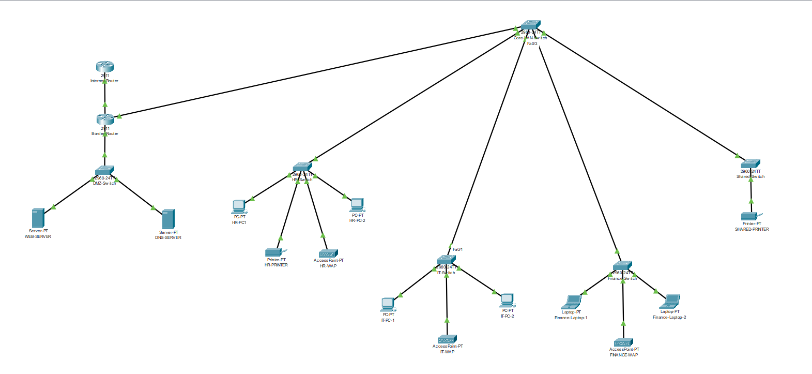

# DMZ Network Architecture – Cisco Packet Tracer

## Overview
This project demonstrates the design and implementation of a three zone 
DMZ network architecture, built using Cisco Packet 
Tracer. I created this as a portfolio piece to demonstrate practical 
networking and network security skills developed throughout my Cyber 
Security and Networking degree.

## Network Diagram

## Network Zones
| Zone | Purpose |
|------|---------|
| Outside (Internet) | Simulates external internet traffic |
| DMZ | Hosts public-facing services (Web Server, DNS) |
| Inside (LAN) | Internal network, inaccessible from the internet |

## VLAN Structure
| VLAN | Name | Subnet | Devices |
|------|-----------|--------|---------|
| VLAN 10 | HR | 192.168.10.0/24 | 2x PC, 1x Wireless AP, 1x Printer |
| VLAN 20 | IT | 192.168.20.0/24 | 2x PC, 1x Wireless AP |
| VLAN 30 | Finance | 192.168.30.0/24 | 2x Laptop, 1x Wireless AP |
| VLAN 40 | Shared Resources | 192.168.40.0/24 | 1x Shared Printer |

## Features
- Three-zone network segmentation (Internet, DMZ, Internal LAN)
- ACL-based firewall rules enforcing strict zone policies
- NAT configuration for internal and DMZ hosts
- Working HTTP web server hosted in the DMZ
- DNS server configuration
- Four VLANs with inter-VLAN routing
- Shared resource VLAN accessible by IT and Finance only
- Wireless access points across all departments
- Full IP addressing and subnetting across all zones

## Technologies Used
- Cisco Packet Tracer
- Cisco IOS (ACLs, NAT, Static Routing, VLANs)
- Subnetting & IP Addressing
- Inter-VLAN Routing
- DNS & HTTP Server Configuration
- Wireless Networking

## Documentation
- [IP Addressing Table](docs/ip-addressing-table.md)
- [ACL Rules & Security Policy](docs/acl-rules.md)

## Author
Vincent | 3rd Year Cyber Security and Networks Student